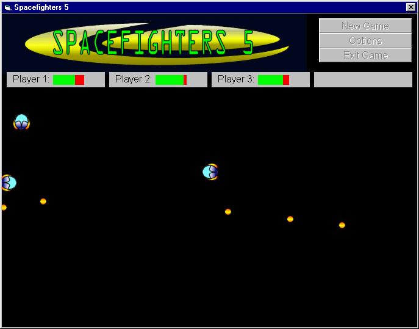



## Spacefighters 5: BETA

### Description

My new game... for some reason even the zip submission earlier was deleted... anyways this is the newest spacefighters... im sure youve probably read the description before but here i go anyways, this new version has better graphics, html help, and alot faster gameplay... some features i plan on adding are key configuration, sound, explosions, and even internet play if i can find help for it... well check it out... and vote if you like (please, please)
 
### More Info
 

             |
---                |---
**Submitted On**   |2003-05-05 18:48:52
**By**             |[poop\_4\_brains](https://github.com/Planet-Source-Code/PSCIndex/blob/master/ByAuthor/poop-4-brains.md)
**Level**          |Intermediate
**User Rating**    |4.8 (24 globes from 5 users)
**Compatibility**  |VB 6\.0
**Category**       |[Games](https://github.com/Planet-Source-Code/PSCIndex/blob/master/ByCategory/games__1-38.md)
**World**          |[Visual Basic](https://github.com/Planet-Source-Code/PSCIndex/blob/master/ByWorld/visual-basic.md)
**Archive File**   |[Spacefight158517582003\.zip](https://github.com/Planet-Source-Code/poop-4-brains-spacefighters-5-beta__1-45350/archive/master.zip)

